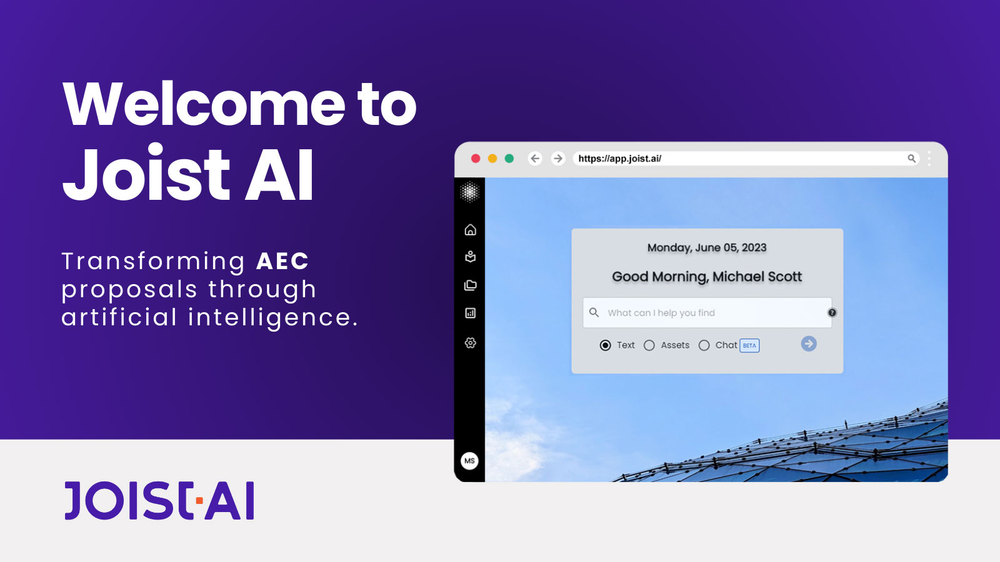

# Knowledge

## Joist AI

<figure><figcaption></figcaption></figure>

Joist AI is a sales enablement and content management platform designed for AEC firms. Our team has uploaded curated content to Joist, and all team members have access to the platform. It can be used for answering questions, finding boilerplate content, and drafting RFP responses.&#x20;

The marketing and communications team utilizes Joist AI as a content management system for our proposals, presentations, communications collateral, and boilerplate RFP content. Joist provides easy searchability of existing marketing and communications collateral and allows our team to also quickly generate new content using prompts.

Joist also allows our team to upload RFQs, RFPs, and RFQ and RFP responses to quickly gather deadlines, key messaging points, and other win strategy items.

**We encourage our team members to use Joist as a research tool and to not rely on Joist as a content creation tool.** It is critical our team members continue to grow their operational knowledge and critical thinking skills to develop RFP content.


Do not use Joist-generated text without closely reading and confirming its accuracy.


Our team works closely with Joist's founder to improve functionality and customize our experience.

Log into Joist at the link below. If you need a login, contact [Katy Klaproth](mailto:kklaproth@robinsmorton.com).



***

## Unanet Knowledge

We utilize our Unanet Knowledge section for Company Information including history, personnel reports, and financial data. All other boilerplate topics are maintained in Joist.

Browse Unanet Knowledge here:


