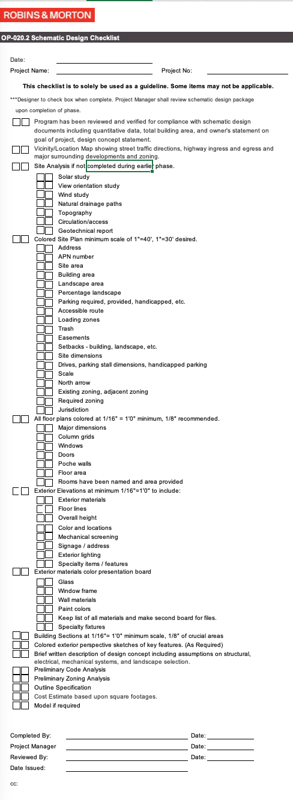

# Photography


To schedule project photography or headshots, contact [Skylar Dickson.](mailto:sdickson@robinsmorton.com)


## OpenAsset

Open Asset is a cloud-based digital asset management tool. Marketing and Communications team members have a unique login with access to upload and download assets.

<figure><figcaption>
OpenAsset Homepage
</figcaption></figure>

This central repository organizes and stores the following Robins & Morton assets:

* In progress and final project photography
* Team member head shots
* Collateral&#x20;
* Stock images
* Conceptual graphics
* Logos
* Event photography
* Video
* Historical images

With OpenAsset, you can drag and drop safety-approved photos directly into InDesign, PowerPoint, and Word.


All project photos are reviewed by Safety before being made available in OpenAsset.


### To install the OpenAsset plugin for InDesign, click below.




For help with or access to OpenAsset, please reach out to [Adria Klein](mailto:aklein@robinsmorton.com).



Watch a video training on the [OpenAsset-InDesign plugin](https://go.openasset.com/OTc0LVRRTi04NzAAAAGcABhvhJ_IGvJYjdh3Z1N525uBv5DtJySaUtb1TAElJf0dBcU5NKYLwmDchchUL2AnK6GuqZ0=)

