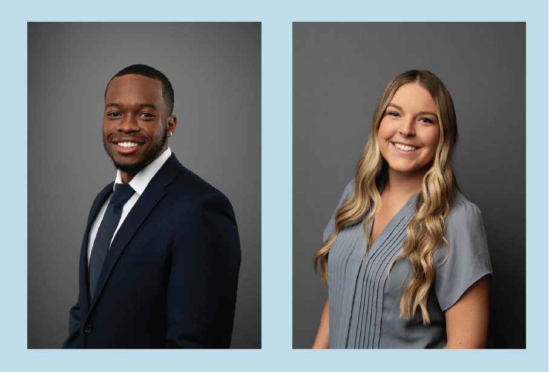

# Headshot Guidelines

Professional and consistent headshots are vital for establishing a cohesive and credible image. They visually represent both your individual brand as well as Robins & Morton’s brand. Consistent headshots enhance brand recognition and foster trust, which are crucial for client development and management. In today’s digital world, a high-quality headshot is essential for making a positive first impression.

***

## How to schedule your photo 

### New Hires

New hire headshots are taken at New Hire Cultural Alignment classes held quarterly in our Birmingham office. Our professional photographer will provide team members with a new, professional headshot taken on our standard background.

* Headshots are taken on the **first day** of the New Hire Cultural Alignment class. _An agenda and additional details will be sent out two weeks prior to the class._
* You will need to provide a **cost code** to cover the $150 fee.
* It takes **up to two weeks** for photos to be processed.
* Photos will be emailed to you once finalized.

### Outdated headshots

Each year we conduct a review of all team member headshots to ensure they are up to date and match our photography brand standards. We encourage all team members to have headshots that are **no more than five years old.**

If a new headshot is needed, you will be contacted by your regional marketing team member with instructions on how to schedule a time to update your photo.

* We can send photographers to our regional or jobsite offices if there is adequate space and enough team members needing new photos.
* We can also provide a photographer with an offsite studio for you to visit if that is more suitable to your schedule.
* Team members will need to provide cost codes for their headshots, which vary in price.

### Extenuating Circumstances

In recognition of potential extenuating circumstances, our marketing team can utilize AI to generate a headshot that aligns with our brand standards. If attending a New Hire Cultural Alignment class or meeting with a photographer is not feasible, please contact [Anna McGough](mailto:anna.mcgough@robinsmorton.com) for additional support.

***

## Best practices for professional photos 

<figure><figcaption></figcaption></figure>

### Clothing suggestions

#### MEN

* Coat and tie
* Solid-colored dress shirt (grays and blues)
* Stay away from bold patterns, colors, and seasonal styles

#### WOMEN

* Jacket not required
* Jewel-toned tops
* Modest v-neck or collarless top
* Stay away from bold patterns and colors, sleeveless tops, large statement jewelry, and seasonal styles

### Photo standards

The standard background for our headshots features a gradient gray, transitioning from dark gray to light gray. This ensures a clean, professional look while providing subtle depth and separation from the subject. Marketing has this background available for use in each of our offices.

If you are traveling outside of our regional offices to have your headshot taken, please ensure your photographer has a background similar to our standard color.

Please refer to the example above for proper lighting and placement when taking headshot photos.

***

## Using Your Headshot 

Once you have your headshot, follow these steps:

### Upload to Microsoft

1. Visit [myaccount.microsoft.com](https://myaccount.microsoft.com)
2. Log in using your company credentials.
3. Click the pencil icon near the profile picture placeholder and choose the upload photo option.
4. Select the file from your device and upload your headshot.

### Uploading to HUB

1. Log into HUB via [hub.robinsmorton.com](https://hub.robinsmorton.com/) and provide your company credentials if required.
2. Navigate to the top right of the page and click the drop-down arrow next to your initials.
3. Select your name and email address to visit your profile.
4. Click “Edit Profile” in the top right corner.
5. After the page refreshes, click the “Upload” option underneath the circular placeholder for a profile image.
6. Select the file from your device and upload your headshot

If you encounter any issues or have questions, please reach out to our IT support team at [help@robinsmorton.com](mailto:help@robinsmorton.com).

## Download the Headshot Guidelines A3



