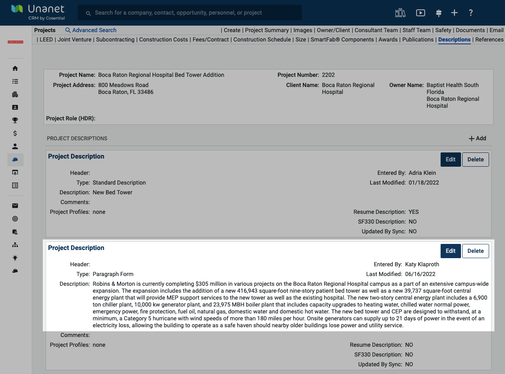

# Description: Paragraph Form

Use the checklist below to ensure that you have enough information on each of your projects. Items 1–4 should be answered on EVERY project. For items 5–8, skip those that are not applicable for your project.

<figure><figcaption>
Example: Paragraph Description
</figcaption></figure>

## **Content**

_Required_

* [ ] **Stories/floors/levels**\
  &#xNAN;_&#x45;xternal builds should be stories; internal build-outs or renovations should be floors; parking decks should be levels (How many levels can you park on?)_
* [ ] **XX,XXX-square-foot or XX,XXX square feet**
* [ ] **Units**
* [ ] **Features**\
  &#xNAN;_&#x45;xample: hospital features – emergency room, three operating rooms, one PACU, 14 ICU beds, and 30 patient rooms_

_Optional_

*   [ ] **Special conditions**

    _Examples: tight site, urban area, brownfield site, contaminated site, occupied space_
* [ ] **Cubic yards of concrete (only if we self-performed concrete)**
* [ ] **Schedule/budget success**\
  &#xNAN;_&#x44;id the project finish on time or early? Did the project finish within or under budget?_
* [ ] **Important challenge and how we overcame it (if applicable) – BRIEF**


**NOTES:**&#x20;

* For demo or remediation projects, please describe the scope of the project in as much detail as possible, recognizing that it is unlikely these projects will follow the exact criteria listed above.
* Do not include information that is part of the InDesign project profile template (i.e., city, state, start and completion dates, value) in the narrative.


***

## Project in Progress 

<mark style="color:purple;">NAME OF PROJECT</mark> **is a** <mark style="color:purple;">X</mark>**-story,** <mark style="color:purple;">XX,XXX</mark>**-square-foot** <mark style="color:purple;">PROJECT TYPE</mark> **facility. It includes** <mark style="color:purple;">\_\_\_\_\_\_</mark>**,** <mark style="color:purple;">\_\_\_\_\_\_\_\_</mark>**, and** <mark style="color:purple;">\_\_\_\_\_\_\_\_\_\_</mark>**. The project is scheduled to be complete in** <mark style="color:purple;">MONTH YEAR</mark>**.**

**Example:**

_The Mayo Clinic Patient Tower Expansion is a five-story, 250,000-square-foot vertical expansion to the existing eight-story North Tower. This vertical addition will add 168 beds and will include three additional patient care floors, one floor for mechanical equipment, and one floor of shell space. The project is scheduled to be complete in January 2027._

***

## Completed Project

<mark style="color:purple;">NAME OF PROJECT</mark> **is a** <mark style="color:purple;">X</mark>**-story**, <mark style="color:purple;">XX,XXX</mark>**-square-foo**t <mark style="color:purple;">PROJECT TYPE</mark> **facility. It included** <mark style="color:purple;">\_\_\_\_\_\_</mark>**,** <mark style="color:purple;">\_\_\_\_\_\_\_\_</mark>**, and** <mark style="color:purple;">\_\_\_\_\_\_\_\_\_\_</mark>**. Built on** <mark style="color:purple;">SITE CONDITIONS</mark>**, the project required** <mark style="color:purple;">CHALLENGE/SOLUTION</mark>**.** <mark style="color:purple;">PROJECT NAME</mark> **is seeking** <mark style="color:purple;">CERTIFICATION</mark>.

### **Simple project example**

_The AdventHealth Carrollwood Freestanding Emergency Department is a single-story, 14,500-square-foot facility that included 12 beds, emergency department services consisting of CT, X-ray, and MRI, and onsite laboratory services._

_One of several offsite emergency departments that Robins & Morton has completed for AdventHealth, the project included clearing and developing four acres of land for a retention pond, offsite turn lanes, and a building pad for a future medical office building and future parking._

### **Average project example:** AdventHealth Tampa Taneja Center for Surgery

_AdventHealth Tampa Taneja Center for Surgery is a six-story, 300,000 square-foot facility that provides surgical care and related post-op services. The multi-phase construction program included a six-level 120,000-square-foot, 282-space parking garage, a two-story, 16,785-square-foot central energy plant to serve the new facility and future growth, and shell space to add six additional operating rooms._

_The Taneja Center ties cleanly into the existing hospital and adds next-generation surgical treatment capabilities and patient-centric care spaces to the existing 1,000,000-square-foot AdventHealth Tampa campus. The facility includes 18 surgical operating rooms, each equipped with advanced surgical robotic technology and telemetry systems; 96 spacious private patient rooms, with readiness to easily add 36 more surgical care beds; and 72 pre-and-post-op rooms, with space for 23 additional rooms. The facility opened in October of 2021._

### **Average project example:** AdventHealth Belleview Offsite Emergency Department

_AdventHealth Belleview Offsite Emergency Department is a single-story, 13,000-square-foot freestanding emergency department. It included 12 patient beds, diagnostic imaging, including CT scans, X-ray, and ultrasound, and a full-service laboratory._&#x20;

_Robins & Morton was engaged early to provide preconstruction services and assist in the development strategy of this complicated site. The property contained an abandoned gas station that required demolition. Robins & Morton collaborated with AdventHealth, S\&ME Civil Engineers, and the state to develop a soil mitigation plan that allowed the project to be completed on schedule. This is one of several freestanding EDs Robins & Morton has completed for AdventHealth._

### **Complex project example**

_AdventHealth Carrollwood is a multi-phase project that included various additions and renovations to the existing Carrollwood campus. Phase I included a new three-story, 62,800-square-foot horizontal expansion and 40,810 square feet of renovation. The scope included a new 14,860-square-foot loading dock, central sterile supply, materials management, and related support space. It also included the addition of 21,670 square feet to the surgery department, including 10 new operating rooms (ORs) with a clean core and OR support spaces and the renovation of 31,360 square feet of the existing surgery department, including two ORs, two cystoscopy ORs, two endoscopy rooms, PACU space, prep/stage II space, interventional radiology space, catheterization lab space, IR/catheterization support space, reception/family waiting space, and staff support space._

_The site infrastructure and utilities scope included the relocation of existing chillers and associated piping of underground water retention vaults, main electrical service, gas service, and water service. The project also included the addition of 2,900 square feet for new chiller relocation space._&#x20;

_Robins & Morton self-performed 21% of the work, including general trades, concrete, carpentry, doors and hardware specialties, drywall, and general cleanup._

***

To ensure our project names and descriptions meet company standards, become familiar with the [In-House Style Guide](../../../corporate-branding/in-house-style-guide.md).

## Special Characters and Style

### Commas

**Be sure commas are added where appropriate.** Occasionally they are omitted from reports and replaced with an extra space. This is a Unanet issue. Be sure they are correct in the project’s profile descriptions.

_Example:_

Remodel of Historic Central Station: Hilton Hotel, Dining, Retail, and Parking Deck

### In-House Style

**Follow the** [**Robins & Morton In-House Style Guide**](https://hub.robinsmorton.com/content/news/article/65c7324bd5903319b3390d74)**.** Entries are listed alphabetically and linked in the index for ease of use. Examples:

* Ampersand (&): Do not use ampersands except in the company name. Spell out “and.” Note: The company name should not be included in Standard Descriptions.
* Buildout: Use _buildout_ rather than _upfit_ or _fit up_.
* Commas: Use commas to separate all elements in a simple series. Our in-house style dictates the use of the Oxford comma.
* Owner: Our preferred term is _client_ (lowercase). Use _owner_ (lowercase) only internally and when the term _client_ may be unclear.
* Subcontractors: Avoid this term. Use _trade contractors_ instead. Never use the term subs. (See _trade contractors / trade partners_ entry.)

