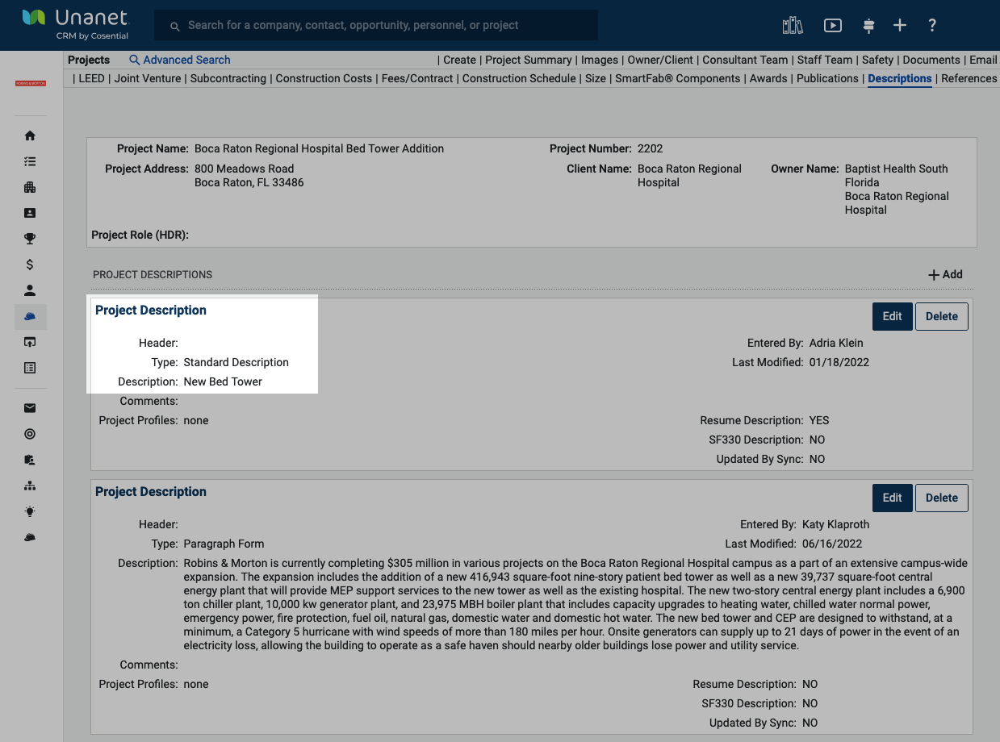

# Description: Standard Description

<figure><figcaption>
Example Standard Description
</figcaption></figure>

## **Capitalization**

**Use title-case capitalization.** An exception to our In-House Style Guide rule on capitalization, we do use title case in Standard Descriptions. As in all title-case situations, conjunctions like “and” and prepositions like “with” should be lowercase to keep it clear and readable.

| ✅ Correct                                                     | ❌ Incorrect                                            |
| ------------------------------------------------------------- | ------------------------------------------------------ |
| **Bed Tower and Surgery Expansion**                           | Mixed-use development with a Medical office component  |
| **Mixed-Use Development with Medical Office**                 | New Hospital CEP Connecting Bridge                     |
| **New Hospital, Central Energy Plant, and Connecting Bridge** | Nurse Call / RTLS Installation / Low Voltage Equipment |

## Numbers

**If you&#x20;**_**must**_**&#x20;use bed numbers or number of stories, do so only because there is no better information available.** Use numeral followed by hyphen and capitalize.

_Both number of stories AND number of rooms should NOT be used in the same description. Delete one of them._

<table data-full-width="false"><thead><tr><th>✅ Correct</th><th>❌ Incorrect</th></tr></thead><tbody><tr><td><strong>129-Room Boutique Hotel</strong></td><td>6-story 117-room boutique hotel</td></tr><tr><td></td><td>3-Story 95-Unit Senior Living and Memory Care Facility</td></tr></tbody></table>

## Square Footage

Do not use square footage in Standard Description.

## Verbs

Do not include actions/verbs.

<table data-full-width="false"><thead><tr><th>✅ Correct</th><th>❌ Incorrect</th></tr></thead><tbody><tr><td><strong>Sterile Processing Department Renovation</strong></td><td>Renovate Sterile Processing Department</td></tr><tr><td></td><td>Investigate Subsurface Conditions at Operating Room and Boardroom</td></tr></tbody></table>

## **Punctuation**

Do not end in a period.

| ✅ Correct                                 | ❌ Incorrect                                              |
| ----------------------------------------- | -------------------------------------------------------- |
| **Lighting and Paving Site Improvements** | Site improvements: paving replacement and site lighting. |

## **Abbreviations**

**In general, do not use acronyms or abbreviations but rather spell them out.**

| ✅ Correct                                                 | ❌ Incorrect                                                              |
| --------------------------------------------------------- | ------------------------------------------------------------------------ |
| **Medical Office Building and Emergency Room Renovation** | New 175 000 SF 6-story 42-bed patient tower addition to an existing FSED |
|                                                           | Replacement of substations SXF/SXG  SXK/SXL  & SXM/SXN                   |
|                                                           | MC Sterile Processing Department                                         |
|                                                           | Peds Cath Lab Equipment Replacement                                      |
|                                                           | MOB, ER, CEP and MRI                                                     |

## Repetitive Information

Clean up entries that currently pull repetitive information in quotation marks at the end.

| ✅ Correct                   | ❌ Incorrect                                                                                                                                     |
| --------------------------- | ----------------------------------------------------------------------------------------------------------------------------------------------- |
| **Pediatric Room Buildout** | Pediatric Build-out (Shell Space Patient Rooms and 2nd & 3rd Floor) "Pediatric Room Buildout"                                                   |
|                             | Emergency Department Expansion Surgery Addition Vertical Expansion and Central Energy Plant Expansion "Surgery ED  4th and 5th Floor Expansion" |

## Building Numbers

Remove job-specific building numbers but document in ‘Other Project Name’ or ‘Description Comments.’

| ✅ Correct                              | ❌ Incorrect                                                 |
| -------------------------------------- | ----------------------------------------------------------- |
| **Patient Tower Renovation**           | Patient Tower Renovation - Duke North - 7700 CCU Renovation |
| **Infrastructure Upgrades**            | 7700 Infrastructure Upgrades                                |
| **Classroom Basement Area Renovation** | Repairs to Classrooms Basement Area Building 301            |
| **Main Chilled Water Valve Repair**    | Repairing Main Chilled Water Valves Building 300            |
