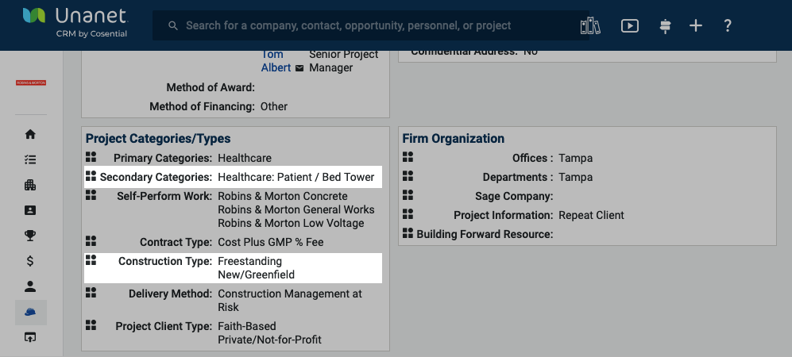

# Greenfield Hospital Secondary Categories


Please talk with the sales leader or project leadership to determine if any additional secondary categories need to be added for each greenfield hospital project.


<figure><figcaption>
Example: Construction Type and Secondary Category
</figcaption></figure>

Healthcare: Acute Care Facility

Healthcare: Administration

Healthcare: Admissions

Healthcare: Cafeteria

Healthcare: Cardiovascular / Heart

Healthcare: CAT / CT Scan

Healthcare: Cath Lab

Healthcare: Central Sterile

Healthcare: Chapel

Healthcare: Consult Room

Healthcare: Courtyard

Healthcare: Critical Care Unit (CCU)

Healthcare: Diagnostic Imaging

Healthcare: Electronic Medical Records

Healthcare: Elevator

Healthcare: Emergency Department (ED)

Healthcare: Energy Plant (CEP) / (DEP)

Healthcare: Gift Shop

Healthcare: Healing Garden

Healthcare: Helipad

Healthcare: Highly Infectious Disease Unit

Healthcare: Hybrid OR

Healthcare: Intensive Care Unit (ICU)

Healthcare: Isolation Unit

Healthcare: Kitchen

Healthcare: Labor/Delivery/Recovery/Postpartum

Healthcare: Laboratory

Healthcare: Laundry

Healthcare: Lobby / Waiting Room

Healthcare: Materials Management

Healthcare: Morgue

Healthcare: MRI

Healthcare: Nurse's Station

Healthcare: Nutritional Services

Healthcare: Operating Room (OR)

Healthcare: Patient Room

Healthcare: Pharmacy

Healthcare: Physicians Lounge

Healthcare: Ultrasound

Healthcare: Waiting Rooms

