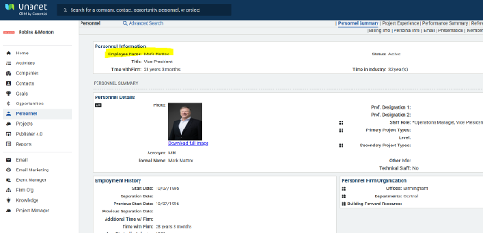

# Publisher

## Update/Create all Standard Resumes in Publisher

1. Search and/or create personnel record in Unanet

<figure><figcaption></figcaption></figure>

2. **Create All Projects Included report** for each personnel (Employee Name as shown on personnel record)

<figure><figcaption></figcaption></figure>

<figure><figcaption></figcaption></figure>

<figure><figcaption></figcaption></figure>

3. **Save report and customize title as needed:**  \_Publisher: last name, first\_EmpID#

\_Publisher: Mattox, Mark\_44232

<figure><figcaption></figcaption></figure>

4. Search **Publisher** for resume by last name.

## Publisher Standard Resume Naming

* "Last Name, First Name"
* Click on resume to open
*   Select desired template

    * Word
    * InDesign
    * Special Variation

    
<figure><figcaption></figcaption></figure>

## Standard Resume Punch List

* Title&#x20;
* Headshot image (Check OA for available headshot / Send Personnel Report to BT to note if needed)
* Education
* Certifications
* Role-Specific Resume Intro
* Projects – Use Project Report to pull in the most recent first to oldest on all resumes.&#x20;
  * Process: Will Use the Reports for Projects on Standard Resumes for:
    * Publisher: last name, first\_EmpID
* **Assign Project Reports using template report** with no sub-projects and change criteria to personnel name:&#x20;
  * Publisher: Mattox, Mark\_44232”&#x20;
* **Criteria for report use 'Personnel Name'**
  * Mark Mattox&#x20;
* **Save As Resume Name with Report Name:**&#x20;
  * \_Publisher: Mattox, Mark\_44232

<figure><figcaption></figcaption></figure>

* **Generate Document and Download the&#x20;**_**idml**_**&#x20;or&#x20;**_**docx**_**&#x20;version.**

<figure><figcaption></figcaption></figure>

* **Output:**

<figure><figcaption></figcaption></figure>

## Options

Create a Standard Resume and select different report options for specific needs like Healthcare:

**Further, if you are working in different templates outside of the Standard,** for naming purposes, you may keep the "last name, first name add the template name". See example for temporary resumes you may be creating:

<figure><figcaption></figcaption></figure>

### NOTE

Maintenance Publisher Cleanup at the End of Year Q4 – Q1

We will remove duplicate resumes not in standard format "last name, first name"
