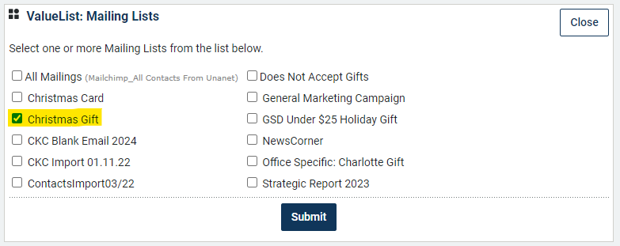

# Client Gift List Prep

Step 1: Request updated contact information from leaders.

**Email each individual their list for review.** Copy admin and marketing team members. Attach the list as an Excel spreadsheet.&#x20;

An example email template is below.

***

> Each year, Robins & Morton sends holiday gifts to clients and partners to show appreciation for their ongoing partnership and support of our people and purpose. We distribute the holiday gifts the week following Thanksgiving.
>
> This year, we will explore the magical world of building with our clients and partners. The campaign will feature a magical world where a community is working together to build something great. To complement this campaign, each client/partner will receive a custom gift \[describe gift] and a complementing video storybook (image attached). This gift will serve as a keepsake and activity for family and friends this holiday season.
>
> As a reminder, Robins & Morton's gifts are valued at approximately $130 (before postage). If you have a client that has monetary giving limits (such as a government employee), **we offer a gift option for under $25 for clients that meet the criteria.** If you would like more information about the under $25 gift, please let me know.
>
> Please follow the steps below to update your client and partner contact list. Your list is attached to this email and available in Unanet here \[insert link].&#x20;
>
> Some questions to keep in mind while reviewing:
>
> * Are your contacts up to date?
> * Should this person receive a holiday gift from Robins & Morton?
> * Is anyone missing? Some contacts may also be on another’s list, so please consider that while reviewing.
>
>
>
> #### **Step 1**
>
> **Ensure your contact is on the “Christmas Gift” Mailing list in Unanet.** 
>
>
>
> #### **Step 2**
>
> **Verify that the mailing address is correct for your contact.** If the address is incorrect the gift will be returned and reshipped, resulting in significant additional cost ($100 per gift on average) and late delivery. To avoid additional re-shipping cost, we need you to be vigilant in providing the correct address.&#x20;
>
> ⚠️ **If a gift requires reshipping, UPS will contact you directly to provide a new address.**&#x20;
>
> If the gift needs to go to a home address, please note that in the “Preferred Gifting Address” field in Unanet. **If this is not noted, the gift will default to their business address.** \
> .png>)
>
> ⚠️ **Please note that shipping cost for a residential address is higher than a business address, only ship to a home address if necessary.**
>
>
>
> #### Step 3
>
> **Update contacts in Unanet as needed.** If you need to make a change, click the hyperlink in their first or last name in the attachment. This will take you to the contact page in Unanet where you can edit as necessary.
>
>
>
> #### Step 4
>
> **Review and edit your contact list before \[due date].** Once all holiday list changes are made, please let me know your list is done.

Step 2: Confirm all lists have been reviewed and track in Monday.com.

_Need link to monday.com board_

Step 3: Pull final contact report from Unanet.

Link to report: [https://services.cosential.com/reports20/ReportsResults.cfm?ReportID=KbRP9DaJT4XSg0Ab6wmuLPqWI\_Ow\~\~\&ReportTypeID=5](https://services.cosential.com/reports20/ReportsResults.cfm?ReportID=KbRP9DaJT4XSg0Ab6wmuLPqWI_Ow~~\&ReportTypeID=5)

Step 4: Complete final review.

1. Check for duplicate contacts
2. Check for Mailing Status, if mailing status equals “DO NOT MAIL.” Confirm with the contact owner that this contact can receive a gift.
3. Addresses:
   1.  **Check preferred gifting address.**&#x20;

       For all contacts flagged for home delivery in the Preferred Gifting Address column, copy and paste the home address to the business address columns. **The business address will now be the source of truth data point.**&#x20;
   2. **Verify there are no blank addresses.**
      * If the business address is blank but there is a home address provided, pull the home address into the business address columns.
      * If both home and business address fields are blank, reach out to the contact owner and make sure they add to Unanet record.
   3. **Verify there are no P.O. Boxes.** If a P.O. Box is listed, please request a new address. We cannot ship to P.O. Boxes.
   4. **Verify correct and complete addresses.** Reformat as needed to ensure they will ship correctly. Check for:
      1. Complete address
      2. Complete zip code
      3. Separate address 1/address 2 if needed
      4. Verify Suite number, etc.
   5. **Add contact info for UPS in the contact owner column.** This is who will be contacted if the shipment has an issue.
      * If the contact is an executive, enter their admin's name and phone number.
      * Enter the direct number of anyone who is not an executive.

Step 5: Lock document.

Once the list is fully edited, lock the document to edits.

Step 6: Send final list to Concepts.

Email to Julianna and Ashlynn at Concepts for mailing prep.&#x20;

