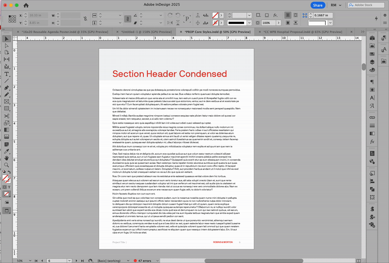
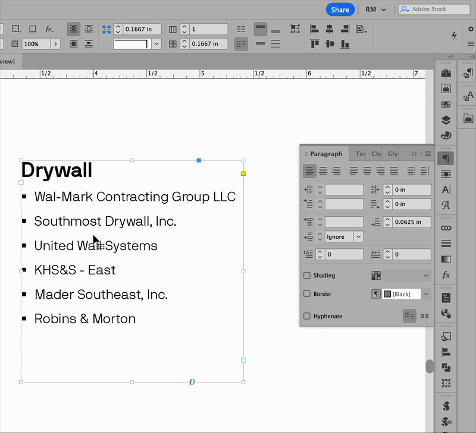
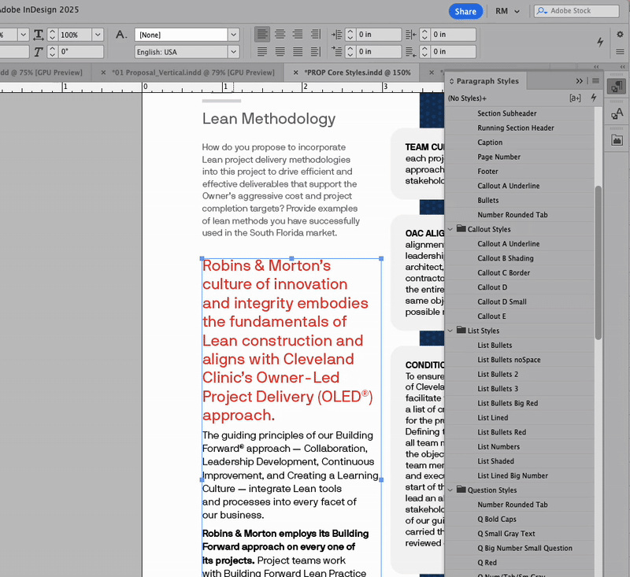

# Graphics FAQ

<details>

<summary>How do I add a new Pantone swatch in InDesign/Illustrator/Photoshop?</summary>

Adobe has discontinued the free inclusion of Pantone color libraries in its software, requiring users to pay for a monthly subscription to the Pantone Connect extension to access Pantone colors. This change was due to a disagreement between the two companies, resulting in the removal of the older, non-integrated Pantone swatches from Adobe products like Photoshop and Illustrator. [Learn more](https://helpx.adobe.com/creative-cloud/adobe-color.html)

You can manually import the old Pantone palette into your Adobe apps.

Import all swatches from a file

1. From the Swatches panel menu, select Load Swatches.
2. Select the .acb file here in Egnyte:&#x20;


```
/Shared/Marketing Department/Graphic Design/#Design Resources/04 Colors/PANTONE Color Books/PANTONE+ Solid Coated.acb
```


</details>

<details>

<summary>What do I need to know about creating safety stickers for hardhats?</summary>


## File Naming

When saving sticker files, please put "sticker" in the filename. This helps with searchability.

As a bonus, include the size of the sticker in the filename for easy reference (ex. Jupiter Safety Orientation Sticker\_2x2.ai)




[Check out our existing sticker designs (of all types)](https://robinsmorton.egnyte.com/app/index.do#storage/search/sticker%20.ai?type=file\&location=%2FShared%2FMarketing%20Department\&modifiedInLast=any\&view=gallery)

The InDesign template files for 2"x2" round Safety Orientation stickers are in Egnyte:


```
/Shared/Marketing Department/Graphic Design/#Design Resources/05 Templates/06 Stickers
```


* In the template file, there are several **parent pages** with different layouts to choose from. You can also design your own.&#x20;
* Safety Orientation sticker files should be saved in the appropriate project folder.
* Smartpress is our preferred (but not required) vendor for hardhat stickers, and the graphics team is happy to order them for you.

#### Numbering

The numbers are a variable that inserts the page number. On the parent page, this variable is represented by a letter, but on the page itself (and when exporting a PDF) you will see sequential numbers. To increase or change the number count, [edit the page numbering in the document.](https://www.youtube.com/watch?v=WZ20bzjYQuk\\)


</details>

<details>

<summary>What's the process for topping out tees?</summary>


## File naming

When saving files for topping out items, please put "topping out" or "top out" in the file name. This helps with searchability.

T-shirt files are saved with the art placement in the filename. This provides clarity for the printer. (ex. Jupiter Topping Out Tee\_LC FB.ai)

**LC** = Left Chest

**FB** = Full Back, FF = Full Front

**LS** = Left Sleeve

**RS** = Right Sleeve&#x20;


* Requests are submitted through the Topping Out Tee request form.
* Files and templates are located in the [Egnyte folder here](https://robinsmorton.egnyte.com/navigate/folder/bd86788d-8299-49ad-a6d9-03d61fddbc8d):


```
/Shared/Marketing Department/Department/Toolbox/Company Store/Promotional Items/Project Specific
```


* Proof is created and sent to the marketer and team for approval before submitting order to Concepts.
* A quote is requested from Concepts if the team requests it or if the request is out of the ordinary.
* Standard shirts are performance material and safety yellow or orange, but teams can request whatever garment and color they want within our standards (no black tees, no stripes).

</details>

<details>

<summary>How do I fit more text into a tight space?</summary>

Here are a few best practices:

### **Make text smaller.**

The standard body font can go as small as 8pt.

Small blocks of text like lists, callouts, or table content can go as small as 7pt.

### Decrease leading.

Leading (rhymes with bedding) is the space between the lines of text in a paragraph. (A general guide for calculating leading is to multiply the font size by 1.2). Our standard \_Body font has room to breathe — 9pt font with 12pt leading (font size multiplied by 1.33).

Leading should never be less than the font size, and even that is only for extreme cases. For example, if your font is 9pt, leading should not be less than 9pt.&#x20;

### **Add columns.**

For large blocks of text, adding columns can save space.&#x20;

<figure><figcaption></figcaption></figure>

### **Remove space between list items.**

Select the list and adjust spacing between items using the Paragraph panel.&#x20;

<figure><figcaption></figcaption></figure>

</details>

<details>

<summary>How do I apply styles more quickly?</summary>

Use the quick apply feature to search and apply styles to text, tables, or objects.

<figure><figcaption></figcaption></figure>

</details>

<details>

<summary>How do I update the TOC in my RFP template?</summary>

The Table of Contents automatically searches your document for any text using the **Section Header** paragraph style and inserts it and the appropriate page number.&#x20;

To update the TOC, select the text box with the TOC placeholder and go to Layout > Update Table of Contents.

#### Troubleshooting

If the content is correct but the styles look wrong, select the TOC text and ensure Character Style is set to None.

If the content is incorrect, ensure that the text you want to include uses the Section Header paragraph style, and no other text is using that style.&#x20;

</details>

<details>

<summary>What do I need to know about resumes in proposals?</summary>


</details>

<details>

<summary>Can I add things to the CC Libraries? </summary>

Yes - but cautiously. The graphics team actively manages the R\&M Branding and Proposal & A3 Graphics libraries to ensure they are organized and useful to the whole team. If you add something to one of these libraries, please let the graphics team know.&#x20;

**Please do not remove from or reorganize these libraries without talking to the graphics team.**

You can create your own personal CC library.

</details>

<details>

<summary>How can I customize InDesign preferences for my workflow?</summary>

With all document windows closed, edit your InDesign preferences. These preferences will be the default on all documents going forward. [Learn more about preferences in InDesign.](https://helpx.adobe.com/indesign/using/setting-preferences.html)

</details>

