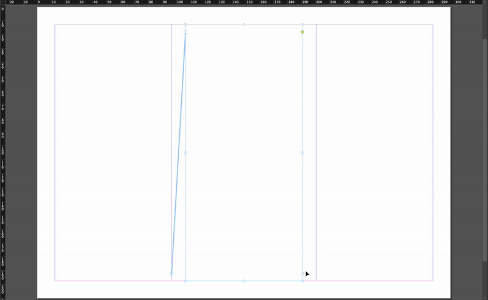
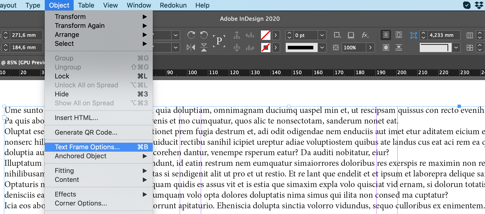
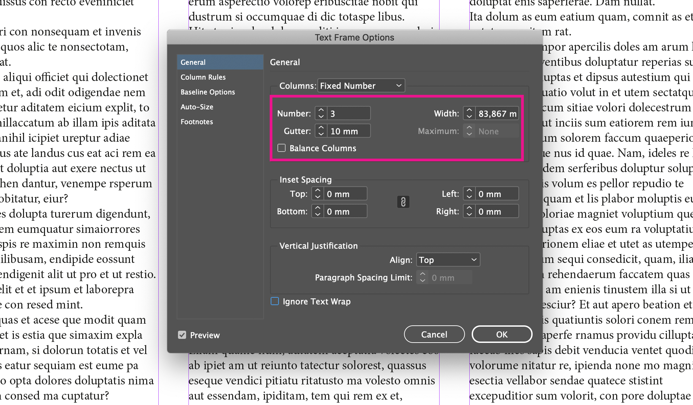
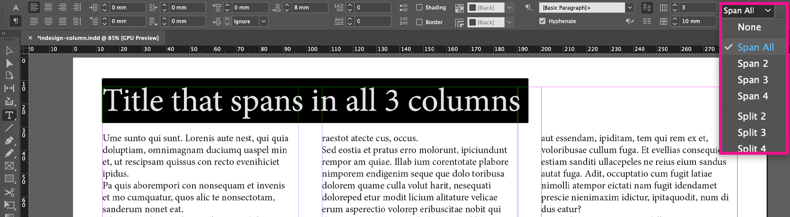
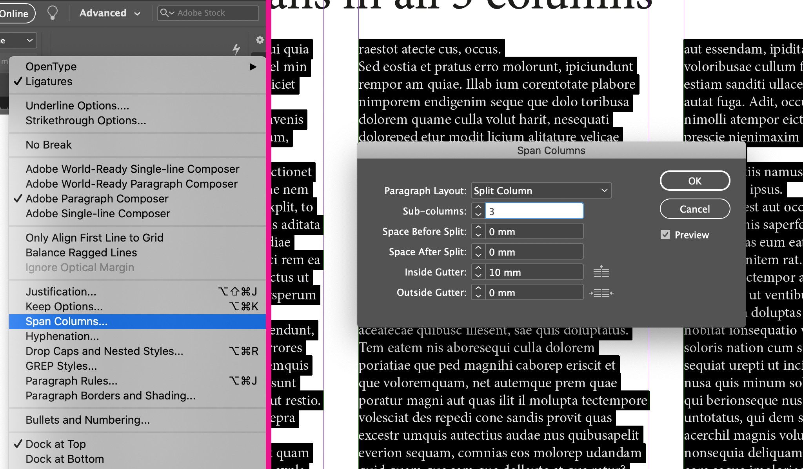
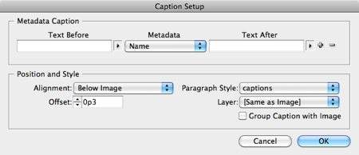

# InDesign Training



| Resource                                                                                                                                                                               | Description                              |
| -------------------------------------------------------------------------------------------------------------------------------------------------------------------------------------- | ---------------------------------------- |
| [Beyond Beginners: Sharpen Your InDesign Skills](https://go.openasset.com/OTc0LVRRTi04NzAAAAGcABhvhLqwDSjUA3IUF_w-mElUYcnea2IhphXbo_it6AfWI1kmOIZQN9exYj1KBLdGlR9c2Ao=)                | Training by Julie Schaffer               |
| [Advanced InDesign Skills You Can Learn in 1 Hour](https://go.openasset.com/OTc0LVRRTi04NzAAAAGcABhvhOIW9iRikkJu3p8jqP6XZrmfjhZTGicBo6Znj_i_Ry_cb-WJRl66X0cTLun1ZN-OQ2w=)              | Training by Julie Schaffer               |
| [The Top 5 InDesign Techniques Your Proposals Need Now](https://go.openasset.com/OTc0LVRRTi04NzAAAAGcABhvhNjO4boRQoeRBQEtPrDRp2RLBrVhCuZ3PlbsY_MhDoEO4AiD8zeojNHHIoYqd6oAMhw=)         | Training by Julie Schaffer               |
| [Proposal Power Moves: Pro Tips for OpenAsset + InDesign Users](https://go.openasset.com/OTc0LVRRTi04NzAAAAGcABhvhCTzR8hqxgNiEYooeiTxbp6EWBl7Y1ogXpsGnVz3G32PzpFu-qwZaaSZoYYreZv03hw=) | Training by Julie Schaffer               |
| [OpenAsset-InDesign plugin](https://go.openasset.com/OTc0LVRRTi04NzAAAAGcABhvhJ_IGvJYjdh3Z1N525uBv5DtJySaUtb1TAElJf0dBcU5NKYLwmDchchUL2AnK6GuqZ0=)                                     | Video training on the OA InDesign plugin |
|                                                                                                                                                                                        |                                          |

Anchored Objects

[About anchored objects](https://helpx.adobe.com/indesign/using/anchored-objects.html)

[Demo](https://www.youtube.com/shorts/kECMTMcp0DQ)

Paste Into

**Use Case:**&#x54;o place an object or text inside an existing frame, treating it as a mask.&#x20;

**Steps:**

1. Copy the object or text you want to paste.&#x20;
2. Select the frame where you want to paste the content.&#x20;
3. Go to `Edit > Paste Into` or right click and select `Paste Into`

Paste Without Formatting

Use this command to paste text while retaining the style of the existing text.&#x20;

To paste without formatting in InDesign, use the keyboard shortcu&#x74;**`Ctrl + Shift + V`** (Windows) or **`Cmd + Shift + V`** (Mac). Alternatively, you can go to the **`Edit`** menu and select **`Paste Without Formatting`**. Keyboard shortcut

* **Mac:** `Cmd + Shift + V`
* **Windows:** `Ctrl + Shift + V`&#x20;

Menu option

* Go to `Edit > Paste Without Formatting`

Columns

There are three different ways to split text into columns in InDesign.

#### **1. Create multiple text frames with** [**threaded content**](https://helpx.adobe.com/indesign/using/threading-text.html)

You can create multiple columns manually by creating multiple text boxes and threading them so the text flows automatically from one text frame to the next.&#x20;

**✅** When to use this method: Create columns this way when your columns need to have **different heights or widths.**

**✅** Guides are helpful when manually adjusting columns.

<figure><figcaption></figcaption></figure>

#### **2. Create a single text box with multiple columns**

Insert the text into your document. Click on Object > Text Frame Options ....

<figure><figcaption></figcaption></figure>

In this window, you can set the number, distance or width of the columns.

<figure><figcaption></figcaption></figure>

When using this method, I'd suggest you create an object style to add to the various text boxes. By doing this, you will be able to change the layout of your document with very few clicks.

**✅**  When to use this method: The main advantage of this method is that you can quickly change the number of columns in the entire document.

In addition, this method allows you, by activating the Balance columns option, to place the same number of rows in each column.

### 3. Split existing text into columns using paragraph settings 

Sometimes you may have to span the text through the columns you just created.

To do this you can use the Span function. You can find it in the paragraph settings (as you see in the image), or when you create a paragraph style inside the Span Columns tab.

<figure><figcaption></figcaption></figure>

1. Select the text you want to divide into columns.
2. On the menu at the top, click on the icon at the top right with 4 horizontal lines and select Span Columns....
3. InDesign will open the window you see in the image below, and inside you will be able to set the values ​​that allow you to divide the text into columns.

<figure><figcaption></figcaption></figure>

Captions

InDesign provides several methods for creating captions that display the name of the image file it is generated from. This is useful because it creates an attached text box using the paragraph style you choose.

#### Caption Setup Options

To determine the content and appearance of the caption you generate, choose **Object > Captions > Caption Settings**, and specify settings. See [Specify caption setup options](https://helpx.adobe.com/indesign/using/captions.html#specify_caption_setup_options).

<figure><figcaption></figcaption></figure>

In the Caption Setup window, the most important features to edit are the alignment of the caption to the image (above, below, left, or right), the offset (space between the image and caption text box), the paragraph style assigned to the caption, and Group Caption with Image (best practice is to turn this on).

**Most images don't contain any other useful metadata besides the Name variable, which inserts the file name.**&#x20;

Why generate captions if they insert the file name instead of something more useful? Because it automatically creates and places a text box that you can then edit the text inside of.

After you've selected your Caption Settings in clicked OK, you then have to generate the caption.&#x20;

#### Static Captions

Choose **Object > Captions > Generate Static Caption**.&#x20;

Static captions are preferred rather than&#x20;

When you choose Generate Static Caption, a new text box is created containing the filename&#x20;

When you choose Generate Live Caption, a new variable is generated automatically based on the current caption settings. For example, if the Description metadata type is selected in the Caption Setup dialog box, a variable called “Live Metadata Caption: Description” is created.

Page Count

There is a dedicated text box available in proposal templates and in the Proposals & A3 Graphics/Page Layouts

