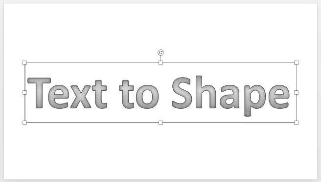
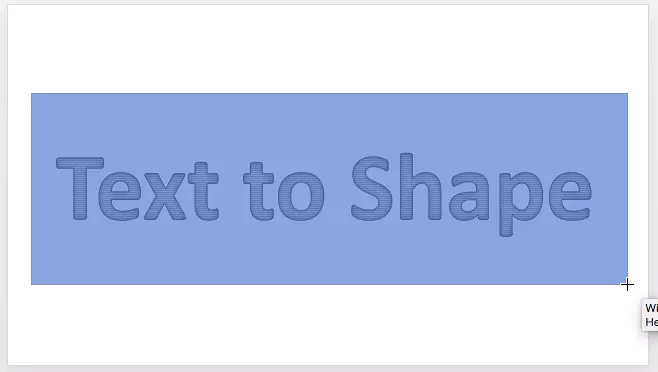
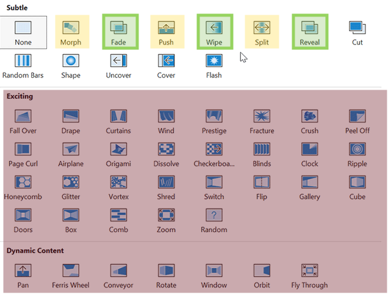
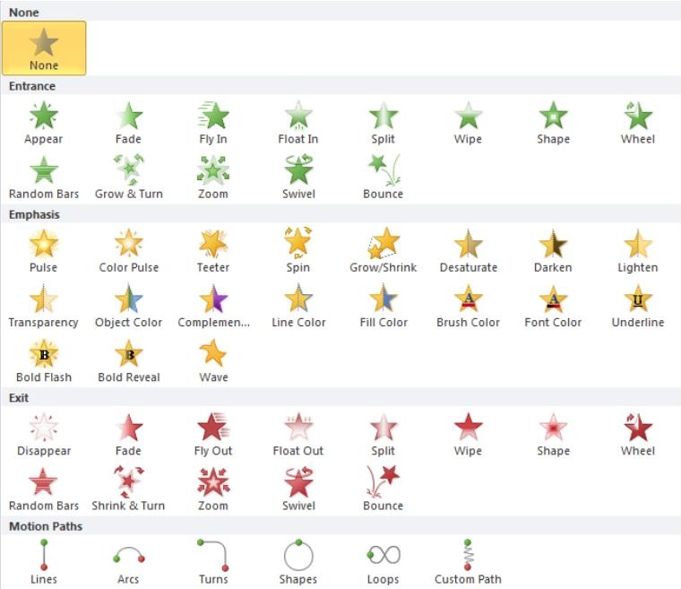

# Tutorials and Troubleshooting

## Tutorials

Microsoft Theme

Using a branded theme will automatically add our brand colors in your Microsoft apps, including Powerpoint. You can find branded theme files in Egnyte:

[/Shared/Brand Assets/05 Document Templates/05 MS Office Themes](https://robinsmorton.egnyte.com/navigate/folder/24c7e704-2a85-4e77-833d-9907e57ea042)

Fonts


## Use Arial exclusively in all presentations.

NB International Pro will only work if it is installed on the machine that is running the slide show. Otherwise, it will be substituted for a default font and will look wrong.&#x20;

No other Microsoft fonts are approved for branded usage.


#### Find/replace fonts in your presentation

In Powerpoint, go to **Format > Replace Fonts...** and select every font that is not Arial and replace it with Arial.

#### Font sizes


Avoid slides where all the text is the same size. Hierarchy is good.


When using Robins & Morton Powerpoint templates, 28pt is the standard body font size. **Do not go smaller than 18pt.**

Outlining Fonts/Converting Text to Shapes

If you want to use NB International Pro for a headline or display font safely, you can convert it to a shape.

1.  Insert a text box and type your text. Select your font and size.  

    
<figure><figcaption></figcaption></figure>

2.  Insert a rectangle that completely covers the text box. 

    
<figure><figcaption></figcaption></figure>

3. Select both the rectangle and text box.&#x20;
4. Go to the Shape Format tab.
5.  Click Merge Shapes, then select Intersect. 

    
<figure><figcaption></figcaption></figure>

Duplicating Slides

Sections

PowerPoint sections are used to organize slides into groups, making it easier to manage and navigate through a presentation while editing.&#x20;

**To add a section:** Right click between two slides and select Add Section. You'll be prompted to name the section.&#x20;

<figure><figcaption></figcaption></figure>

**To edit or remove sections:** Right click on an existing section and choose the preferred option.

<figure><figcaption></figcaption></figure>

Notes

Transitions

Interactive Content

Hide Background Graphics

This check box will hide any locked graphics on your slide, like the wordmark in the footer.

Changing or replacing images on a slide

Right-click the image and choose **Change Picture...** from the context menu.&#x20;

### To replace with an OpenAsset image:

1. Drag the replacement image you want into your slide
2. Copy the image
3. Right click the existing image container, and select **Change Picture...** > **From Clipboard**
4. Delete the image you dragged in originally

Slide Transitions

<figure><figcaption></figcaption></figure>

Transitions between slides are an easy way to make your presentations feel polished. Best practices:

* **Keep it subtle.** If viewers notice your transitions, you're doing too much.
  * Safe transitions are Fade, Wipe, and Reveal.
  * **Do not use** transitions in the Exciting or Dynamic Content categories.
* **Keep them snappy.** Powerpoint's default timing often feels sluggish, so shorten the length of the transitions you use.
* **Keep transitions consistent** throughout the presentation - never use more than two types of transitions in a single presentatio&#x6E;**.**

**Exceptions to the rule:** If you are trying to show a concept that involves movement, use whatever transition makes sense to convey that. Push, Split, and Morph can be useful for specific types of content.


## Always test your show in presentation mode before going live.

Ensure transitions are consistent, timely, and not distracting.


#### Effect Options

Each effect has options, like direction, that you can customize. 

#### Effect Timing

<figure><figcaption></figcaption></figure>

Default transition timings often feel sluggish - generally they shouldn't last longer than 1 second. Edit transitions accordingly.

By default, slides change on mouse click. You can change this setting so the slide advances automatically after a set number of seconds.

When you make any of these changes, you can choose to apply changes to all slides at once.

Animations

<figure><figcaption></figcaption></figure>

Use animations intentionally.  Some best practices are:

* **Keep it subtle:** Avoid over-the-top animations that distract from your message.
* **Be consistent:** Use similar animation styles throughout your presentation to maintain cohesion.
* **Use timing strategically:** Adjust delays and durations to match your speaking pace and emphasize key points.

#### Types of animations

* **Entrance animations** determine how an object appears on the slide. Examples include Fade In, Fly In, and Zoom.
* **Emphasis animation** highlight or draw attention to an object already on the slide, such as Spin or Pulse.
* **Exit animations** control how an object leaves the slide, like Fade Out or Fly Out.
* **Motion path animations** allow you a high level of control over how an object moves.

| <h4>Animation Pane</h4>
The Animation Pane is your control center for managing all animations on a slide. 

At the top of the panel you will see all active animations on the slide. You can drag and drop to change the order, or select an animation and delete it.

<strong>Effect Options</strong>

Each animation has options you can edit to your liking.

<strong>Timing</strong>

By default, animations are set to begin when the slide is clicked (On Click). You can change to With Previous or After Previous - this will make the animation run automatically, either with the previous animation or after the previous animation has finished.

<strong>Triggers</strong>

You can set an animation to begin when you click on a specific object.

<strong>Text animations</strong>

An animation effect option called By Paragraph lets you make list items appear one at a time. This type of animation is sometimes called a build slide.

<a href="https://support.microsoft.com/en-us/office/animate-or-make-words-appear-one-line-at-a-time-in-powerpoint-cfb5ebdc-90cf-4324-8933-874c7c840175">Learn more about text animations</a>

 |  |
| ----------------------------------------------------------------------------------------------------------------------------------------------------------------------------------------------------------------------------------------------------------------------------------------------------------------------------------------------------------------------------------------------------------------------------------------------------------------------------------------------------------------------------------------------------------------------------------------------------------------------------------------------------------------------------------------------------------------------------------------------------------------------------------------------------------------------------------------------------------------------------------------------------------------------------------------------------------------------------------------------------------------------------------------------------------------------------------------------------------------------------------------------------------------------------------------------------------------------------------------------------------------- | -------------------------------------------------------------------- |

#### Animating Photos and Videos

Visual media can be animated to add flair and focus, but it’s important to use animations thoughtfully:

* **Animate photos with entrance and exit effects:** Introduce images dynamically to support your narrative.
* **Use motion paths:** Guide photos or videos across the slide for storytelling or emphasis.
* **Control video playback:** Set videos to start automatically or on click, and incorporate fade-ins or zooms for smooth transitions.

#### &#x20;

Design Suggestions

PowerPoint's **Design Suggestions** (formerly and often still called **Designer**) is an AI-driven service that automatically generates professional slide layouts based on your content. It works by analyzing photos, charts, and text to suggest blueprints for high-quality visuals.

**Best Practices & Guidelines**

* **Content Limits:** The AI performs best with **one to four images** per slide. For text, follow the **6x6 rule** (max 6 lines of text, 6 words per line) to ensure clean suggestions.
* **Use Standards Layouts:** Suggestions only work on **Title** or **Title + Content** slide layouts. Custom themes or complex shapes manually drawn on a slide can disable the feature.
* **Prioritize Accessibility:** Design for 2026 emphasizes **accessibility-first** slides. Choose suggestions with high color contrast and font sizes of at least **18pt** for body text.
* **Human Touch:** Use AI as a starting point for structure, but manually refine your "hook" and narrative flow to avoid the "uncanny valley" of generic AI-generated decks.
* **Troubleshooting:** If ideas do not appear, ensure you are not **co-authoring** (editing the same slide simultaneously with another person), and check that **optional connected experiences** are enabled in your Privacy Settings.&#x20;

## Troubleshooting

Pasted content looks wrong

